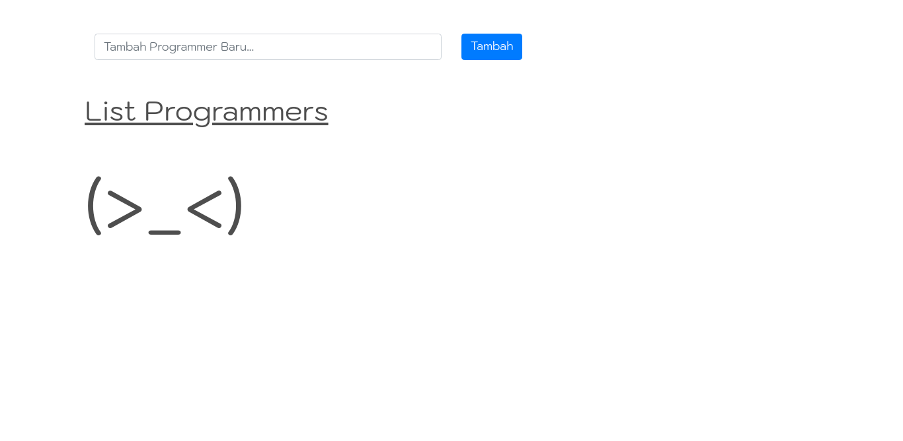

# Bismillah

----

## Untuk Soal No.1

 - **_REST API_** adalah suatu layanan _web API_ yang dalam pembuatannya menerapakan gaya arsitektur _REST_.
 - Kegunaan _JSON_ pada _REST API_ adalah format data yang dihasilkan dari sebuah _API_ yang nantinya data _JSON_ tersebut dikonsumsi oleh pengguna _API_ tersebut .
   

---

## Setup Database Untuk Soal No.6:

- Buat Database **programmer_db**:

  ```mysql
  CREATE DATABASE `programmer_db`;
  ```

- Buat Table **users** :

  ```mysql
  CREATE TABLE `users` (
    `id` int(11) NOT NULL AUTO_INCREMENT,
    `name` varchar(50) NOT NULL,
    PRIMARY KEY (`id`)
  ) ENGINE=InnoDB AUTO_INCREMENT=65 DEFAULT CHARSET=latin1
  ```

- Buat Table **skills** :

  ```mysql
  CREATE TABLE `skills` (
    `id` int(11) NOT NULL AUTO_INCREMENT,
    `name` varchar(50) NOT NULL,
    `user_id` int(11) NOT NULL,
    PRIMARY KEY (`id`),
    KEY `user_id` (`user_id`),
    CONSTRAINT `skills_ibfk_1` FOREIGN KEY (`user_id`) REFERENCES `users` (`id`) ON DELETE CASCADE
  ) ENGINE=InnoDB AUTO_INCREMENT=45 DEFAULT CHARSET=latin1
  ```

  ---

  ## Capture Soal No.6

  - Tampilan Awal (Belum ada data).
  
  
  
  - Menambahkan nama programmer baru.
  
  
  
  - Menambahkan skill baru
  
    
  
  - Menambahkan user dan skill baru.
  
    
  
  - Menghapus salah satu programmer.
  
  - Hasil akhir setelah hapus programmer.
  
    ---
  
    Sekian Terima kasih